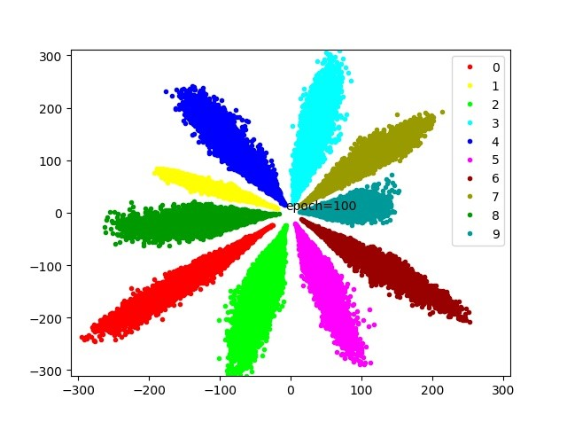
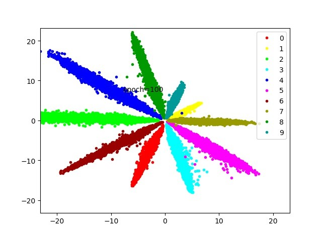
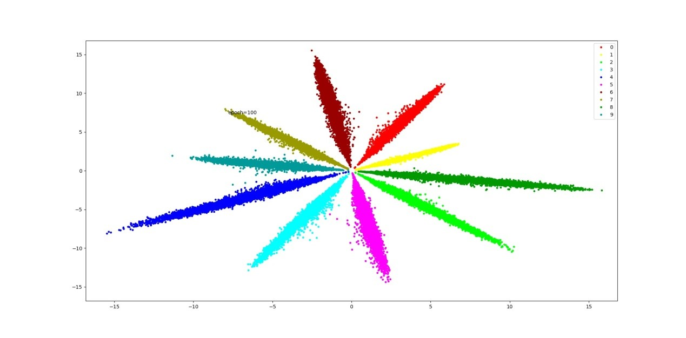
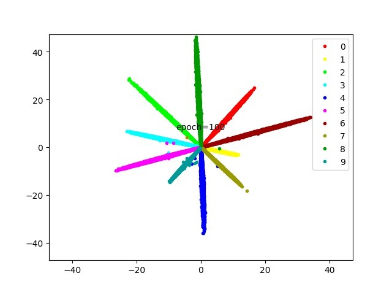
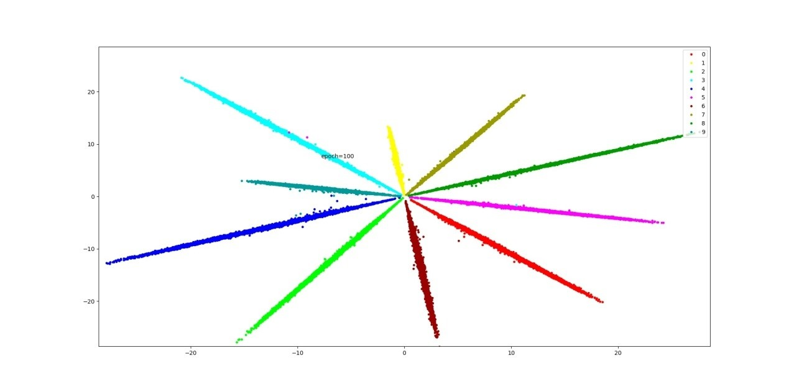

# Contraction-Mapping-of-Feature-Norms-for-Data-Quality-Imbalance-Learning

## 0. Introduction
This repository contains Pytorch code for the paper entitled with"Contraction Mapping of Feature Norms for Data Quality Imbalance Learning" . This paper will be released soon.

In the field of  deep learning-based image classification,  the data for training image classifiers usually have different quality. Hence, the  low-quality data are hard to correctly classify.  In this paper, we discover that there is a positive correlation between the quality of a sample and its feature norm learned with softmax loss. Therefor, we propose a contraction mapping function of feature norms and use it to develop novel softmax losses.  Experiments on various classification applications, including handwritten digit recognition, lung nodule classification, face verification, and face recognition, demonstrate that the proposed approach is promising to effectively deal with the problem of learning data with different quality and leads to significant and stable improvements in the classification accuracy.

## 1. Usage
##### CMMSoftLoss.py
The proposed contraction mapping of feature norms, which is embedded into classical and large margin-based softmax losses to produce new learning objectives.

#### MNIST_with_CMMLoss.py
The evaluation of  the proposed CM-M-Softmax losses in handwritten digit classification.

Visualization of 2-D features of the test samples in MNIST, learned by using (a) Softmax; (b) L2-softmax; (c) CM-M-Softmax; (d) Margin&L2-Softmaxloss; (e) Margin&CM-M-Softmax.

| (a) Softmax           | L2-softmax            | CM-M-Softmax          | Margin&L2-Softmaxloss | Margin&CM-M-Softmax   |
| --------------------- | --------------------- | --------------------- | --------------------- | --------------------- |
|  |  |  |  |  |

